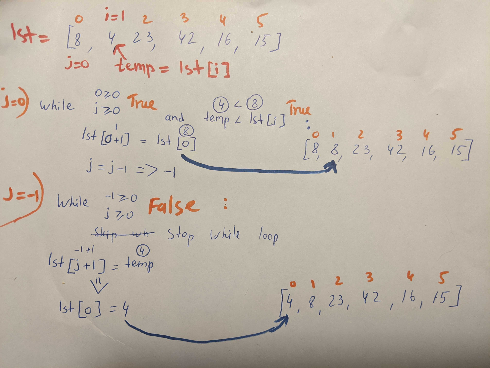
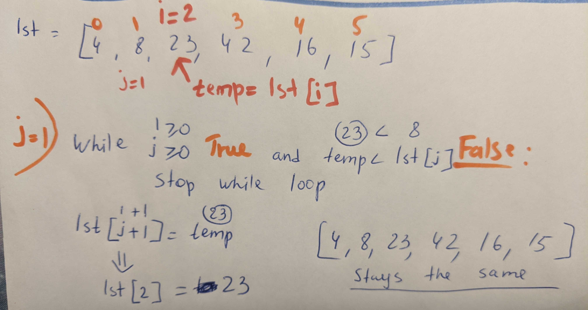
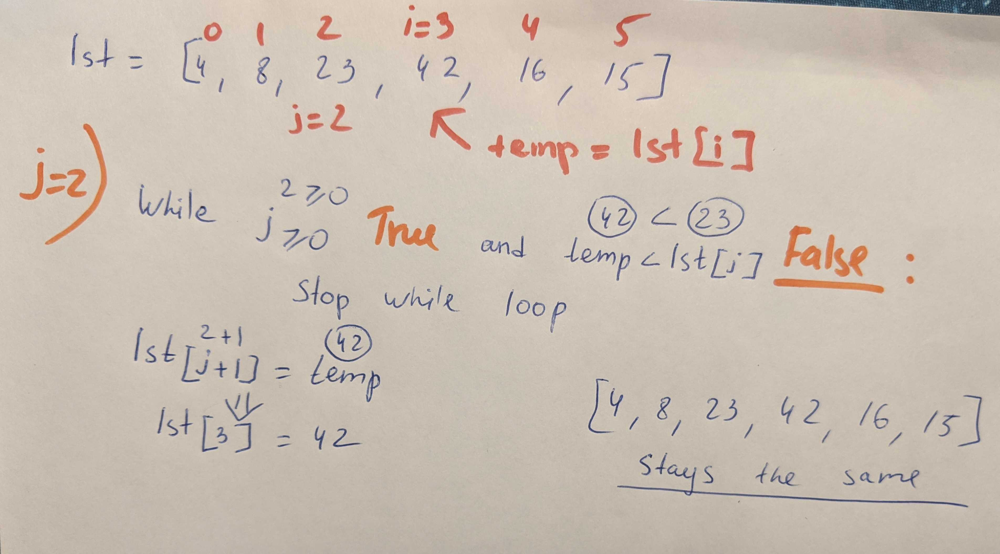
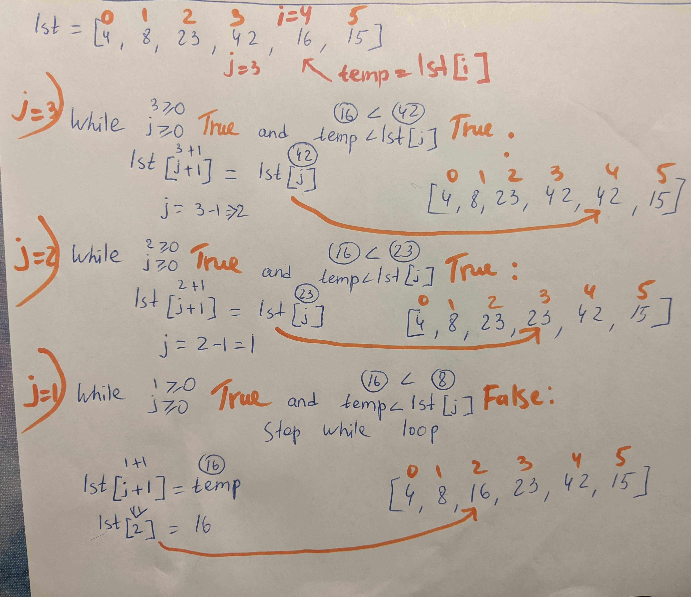
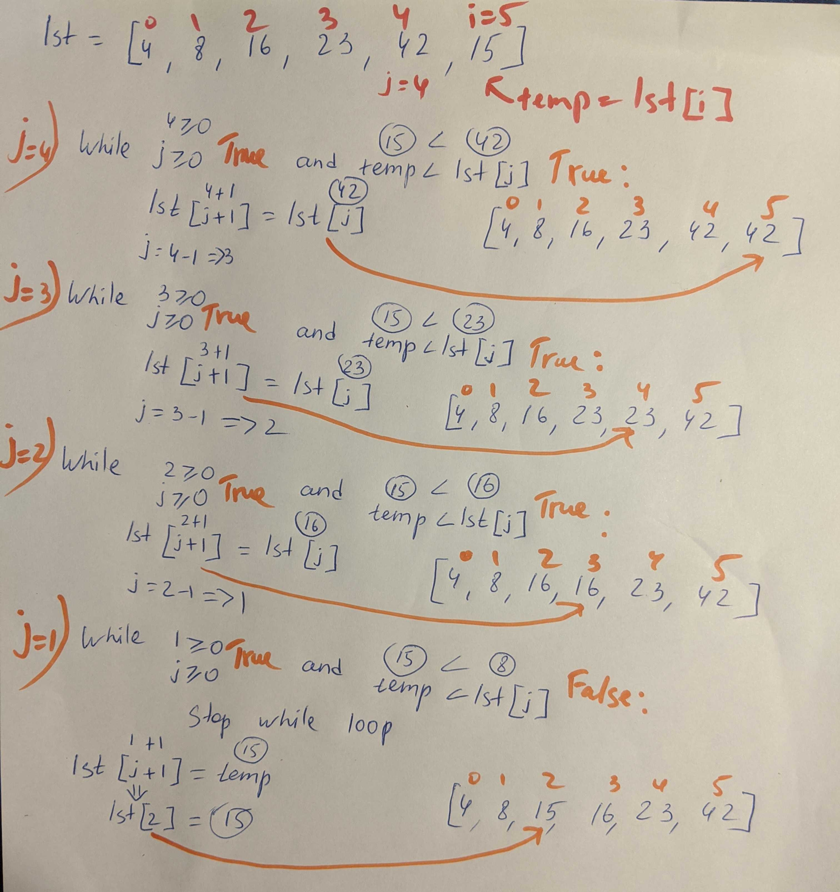

# Insertion Sort

Insertion sort is a type of sorting algorithm. We start with the first element in the array. One element by itself is already sorted. Then we consider the next element in the array. If it is smaller than the first, we swap them. Next we consider the third element in the array. We swap it leftward until it is in its proper order with the first two elements. We then consider the fourth element, and swap it leftward until it is in the proper order with the first three. We continue in this manner with the rest of the elments until the whole array is sorted.

# Pseudocode

```
 InsertionSort(int[] lst)

    FOR i = 1 to len(lst)

      int j <-- i - 1
      int temp <-- lst[i]

      WHILE j >= 0 AND temp < lst[j]
        lst[j + 1] <-- lst[j]
        j <-- j - 1

      lst[j + 1] <-- temp
```
# Trace

**Sample array: [8,4,23,42,16,15]**

**Pass 1**



We start with the first element in the array (8). One element by itself is already sorted. Then we consider the next element in the array(4). 4 is smaller than 8, so we swap them.

**Pass 2**



Next we consider the third element (23) in the array. It is bigger than 8 so we left it in the same place.

**Pass 3**



Next we consider the fourth element (42) in the array. It is bigger than 23 so it stays in the same place.

**Pass 4**



Next we consider the fifth element (16) in the array. It is smaller than 42 so we swap it leftward until it is in its proper order with the first elements.

**Pass 5**



Next we consider the sixth element (15) in the array. It is smaller than 16 so we swap it leftward until it is in its proper order with the first elements. 15 was the last element in our array, so our for loop is over as well as our sort.

**Sorted array: [4, 8, 15, 16, 23, 42]**


# Efficiency

* Space complexity Big O(1)
* Time complexity Big O(n^2)
