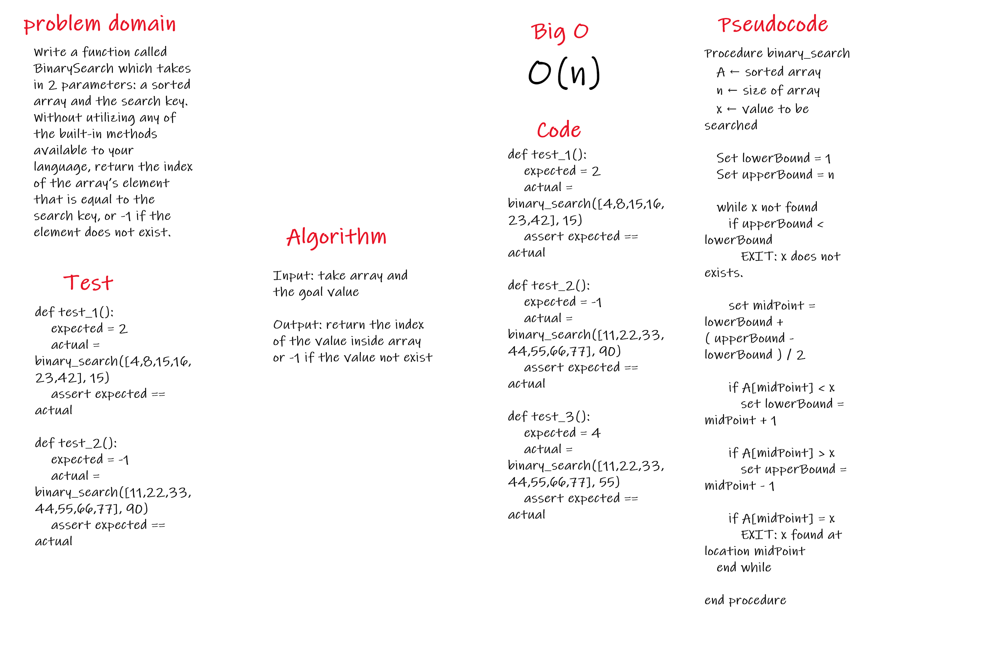

# Challenge Summary
Write a function called BinarySearch which takes in 2 parameters: a sorted array and the search key. Without utilizing any of the built-in methods available to your language, return the index of the array’s element that is equal to the search key, or -1 if the element does not exist.

## Challenge Description
Input: take array and the goal value

Output: return the index of the value inside array or -1 if the value not exist

## Approach & Efficiency
it toke frome me more than expected because it have tricky logic

## Solution
