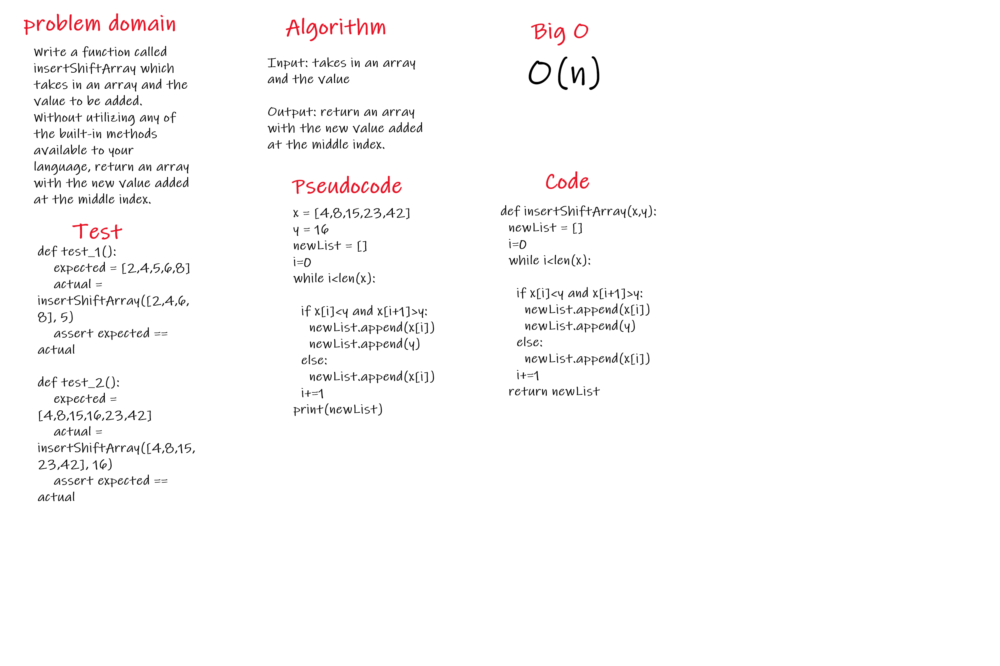

# Challenge Summary
Write a function called insertShiftArray which takes in an array and the value to be added. Without utilizing any of the built-in methods available to your language, return an array with the new value added at the middle index.

## Challenge Description
Input: takes in an array and the value

Output: return an array with the new value added at the middle index.

## Approach & Efficiency
it toke frome me more than expected because of error on naming in test file

## Solution
