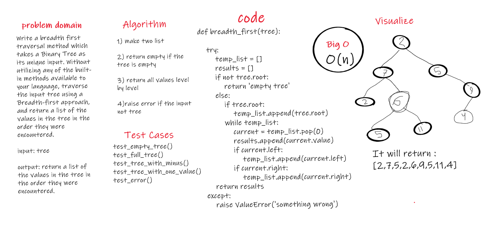

# Challenge Summary
Write a breadth first traversal method which takes a Binary Tree as its unique input. Without utilizing any of the built-in methods available to your language, traverse the input tree using a Breadth-first approach, and return a list of the values in the tree in the order they were encountered.

## Challenge Description
input: tree
output: return a list of the values in the tree in the order they were encountered.

## Approach & Efficiency
it toke frome me more than expected ...

## Solution
