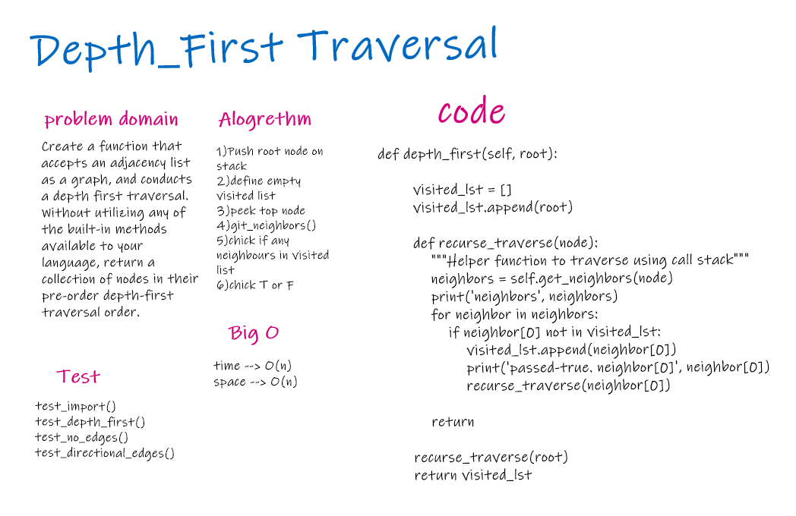

# Challenge Summary
Depth first traversal works by using a stack. We start by adding the root node to the top of the call stack. As long as there are neighbors that have not been visited in the stack, we continue to add unvisited nodes to the stack. We pop off nodes from the stack when they cease to have unvisited children.

## Challenge Description

In this module we are taking advantage of the way using a function recursively uses the call stack. The call stack becomes our stack. And we invoke the recurse_traverse function inside of itself untill it reaches its base case - where there are no unvisited neighbors. At this base case we return and at that point it is "popped" off of the call stack.

## Approach & Efficiency

For time and space this algorithm is O(N). We are creating a list of all nodes that were traversed (N) and we are calling the recurse_traverse function for each unvisited node (N nodes).

## Solution
