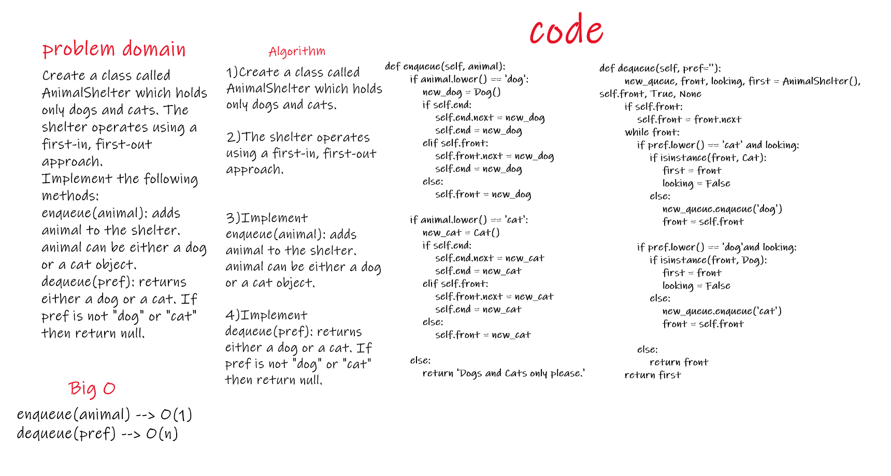

# Challenge Summary
Stack is a container of objects that are inserted and removed according to the last-in first-out (LIFO) principle.

Queue is a container of objects (a linear collection) that are inserted and removed according to the first-in first-out (FIFO) principle.

## Challenge Description
Create a class called AnimalShelter which holds only dogs and cats. The shelter operates using a first-in, first-out approach.
Implement the following methods:
enqueue(animal): adds animal to the shelter. animal can be either a dog or a cat object.
dequeue(pref): returns either a dog or a cat. If pref is not "dog" or "cat" then return null.

## Approach & Efficiency
it toke frome me more than expected ...

## Solution
