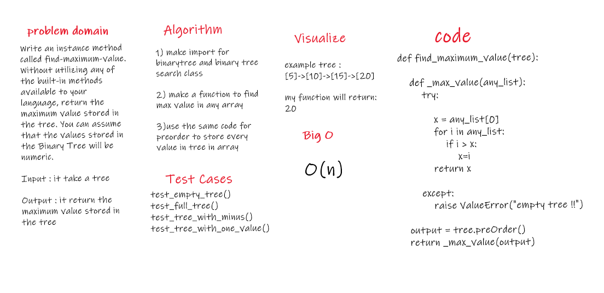

# Challenge Summary
Write an instance method called find-maximum-value. Without utilizing any of the built-in methods available to your language, return the maximum value stored in the tree. You can assume that the values stored in the Binary Tree will be numeric.

## Challenge Description
Input : it take a tree

Output : it return the maximum value stored in the tree

## Approach & Efficiency
it toke frome me less than expected ...

## Solution
