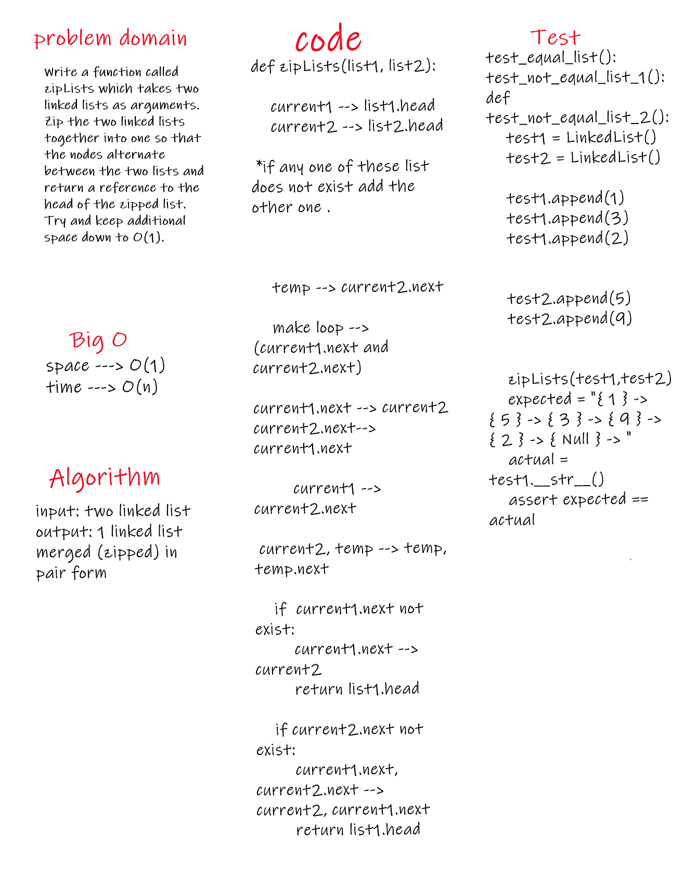

# Challenge Summary
Write a function called zipLists which takes two linked lists as arguments. Zip the two linked lists together into one so that the nodes alternate between the two lists and return a reference to the head of the zipped list. Try and keep additional space down to O(1).Write a function called zipLists which takes two linked lists as arguments. Zip the two linked lists together into one so that the nodes alternate between the two lists and return a reference to the head of the zipped list. Try and keep additional space down to O(1).

## Challenge Description
input: two linked list
output: 1 linked list merged (zipped) in pair form

## Approach & Efficiency
it toke frome me more than expected ...

## Solution
