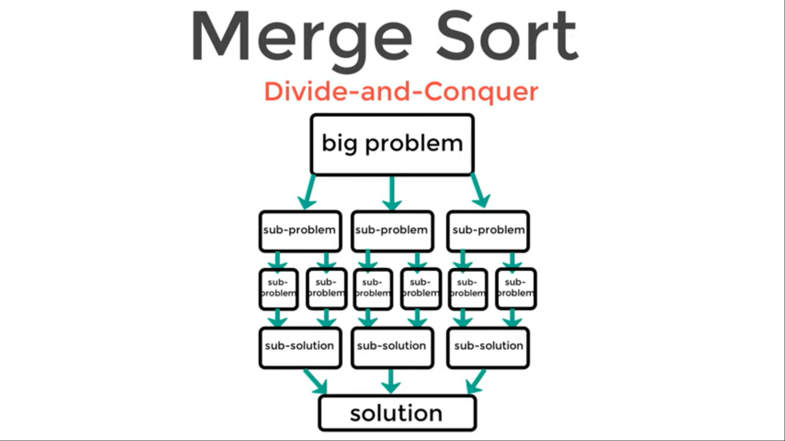
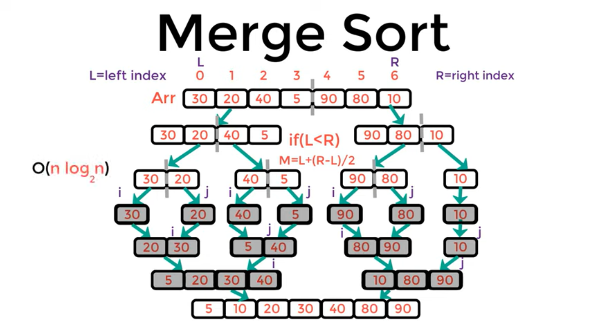

# Merge Sort

Merge sort breaks a list up into the smaller lists than merges the lists back together in order.

* Merge sorts a fast but require a big amount of memory.
* Merge Sort is useful for sorting linked lists.
* Merge Sort is a stable sort which means that the same element in an array maintain their original positions with respect to each other.

**To sort a sequence S with n elements using the three divide-and-conquer steps, the merge-sort algorithm proceeds as follows:**

1. Divide: If S has zero or one element, return S immediately; it is already sorted. Otherwise (S has at least two elements), remove all the elements from S and put them into two sequences, S1 and S2, each containing about half of the elements of S; that is, S1 contains the first [n/2] elements of S, and S2 contains the remaining [n/2] elements.
1. Conquer: Recursively sort sequences S1 and S2.
1. Combine: Put back the elements into S by merging the sorted sequences S1 and S2 into a sorted sequence.

## Pseudocode

```
ALGORITHM Mergesort(arr)
    DECLARE n <-- arr.length
           
    if n > 1
      DECLARE mid <-- n/2
      DECLARE left <-- arr[0...mid]
      DECLARE right <-- arr[mid...n]
      // sort the left side
      Mergesort(left)
      // sort the right side
      Mergesort(right)
      // merge the sorted left and right sides together
      Merge(left, right, arr)

ALGORITHM Merge(left, right, arr)
    DECLARE i <-- 0
    DECLARE j <-- 0
    DECLARE k <-- 0

    while i < left.length && j < right.length
        if left[i] <= right[j]
            arr[k] <-- left[i]
            i <-- i + 1
        else
            arr[k] <-- right[j]
            j <-- j + 1
            
        k <-- k + 1

    if i = left.length
       set remaining entries in arr to remaining values in right
    else
       set remaining entries in arr to remaining values in left

```

## Trace

**Sample array: [30,20,40,5,90,80,10]**






Our function merge sort recursivly devides our list by half, than its left and right part on half and so on. at the same time inside each mege_sort() function call we are calling merge() function and passing to it the current left, right, and part of the list. The merge() function should merge in proper order all element from left and right sequences.

Our merge(left, right, lst) function will start form the bottom of our "tree".

**Sorted array: [5,10,20,30,40,80,90]**

## Efficiency

**Space complexity Big O(n)**

**Time complexity Big O(nLogn)**