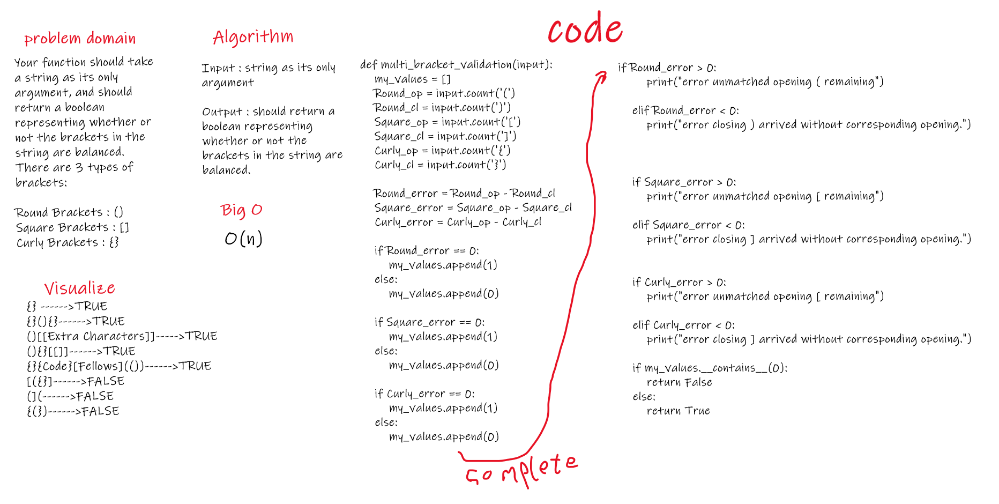

# Challenge Summary
Your function should take a string as its only argument, and should return a boolean representing whether or not the brackets in the string are balanced. There are 3 types of brackets:

Round Brackets : ()
Square Brackets : []
Curly Brackets : {}

## Challenge Description
Input : string as its only argument

Output : should return a boolean representing whether or not the brackets in the string are balanced. 

## Approach & Efficiency
it toke frome me more than expected ...

## Solution
