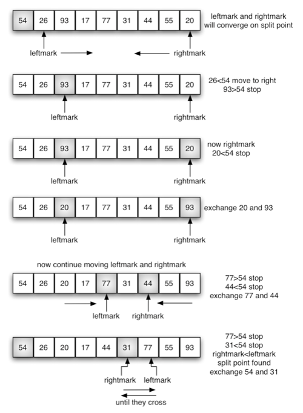

# Quick Sort

**Overview**

The quick sort uses divide and conquer to gain the same advantages as the merge sort, while not using additional storage. 

As a trade-off, however, it is possible that the list may not be divided in half. 

When this happens, we will see that performance is diminished.

A quick sort first selects a value, which is called the pivot value. 

The role of the pivot value is to assist with splitting the list.

The actual position where the pivot value belongs in the final sorted list, commonly called the split point, will be used to divide the list for subsequent calls to the quick sort.

**Pseudocode**

```
ALGORITHM QuickSort(arr, left, right)
    if left < right
        // Partition the array by setting the position of the pivot value 
        DEFINE position <-- Partition(arr, left, right)
        // Sort the left
        QuickSort(arr, left, position - 1)
        // Sort the right
        QuickSort(arr, position + 1, right)

ALGORITHM Partition(arr, left, right)
    // set a pivot value as a point of reference
    DEFINE pivot <-- arr[right]
    // create a variable to track the largest index of numbers lower than the defined pivot
    DEFINE low <-- left - 1
    for i <- left to right do
        if arr[i] <= pivot
            low++
            Swap(arr, i, low)

     // place the value of the pivot location in the middle.
     // all numbers smaller than the pivot are on the left, larger on the right. 
     Swap(arr, right, low + 1)
    // return the pivot index point
     return low + 1

ALGORITHM Swap(arr, i, low)
    DEFINE temp;
    temp <-- arr[i]
    arr[i] <-- arr[low]
    arr[low] <-- temp

```

**Trace**

Sample array: [54,26,93,17,77,31,44,55,20]

54 is out first pivot value.

The partition process will happen next. 

It will find the split point and at the same time move other items to the appropriate side of the list, either less than or greater than the pivot value.




this process done recursively until get sorted array

**Sorted array: [17, 20, 26, 31, 44, 54, 55, 77, 93]**

**Efficiency**

Space complexity Big O(log(n))

Time complexity Big O(n^2)