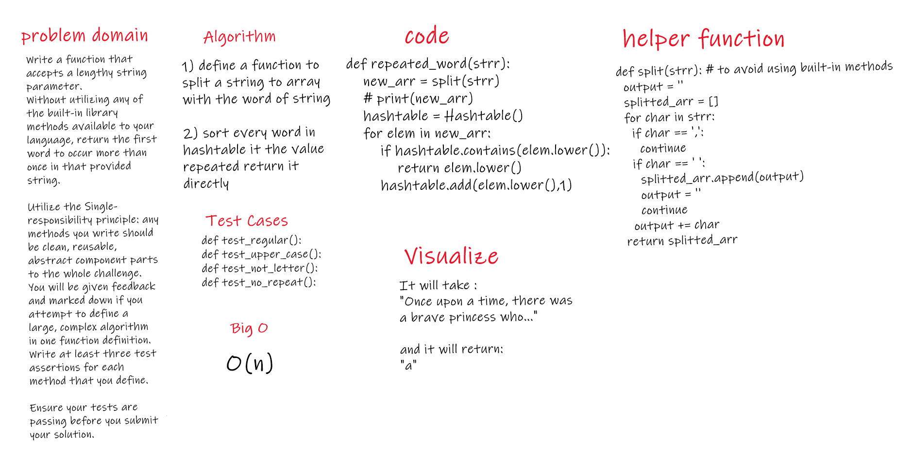

# Challenge Summary
Write a function that accepts a lengthy string parameter.
Without utilizing any of the built-in library methods available to your language, return the first word to occur more than once in that provided string.

Utilize the Single-responsibility principle: any methods you write should be clean, reusable, abstract component parts to the whole challenge. You will be given feedback and marked down if you attempt to define a large, complex algorithm in one function definition.
Write at least three test assertions for each method that you define.

Ensure your tests are passing before you submit your solution.

## Challenge Description
1) define a function to split a string to array with the word of string

2) sort every word in hashtable it the value repeated return it directly

## Approach & Efficiency
O(n)

## Solution
